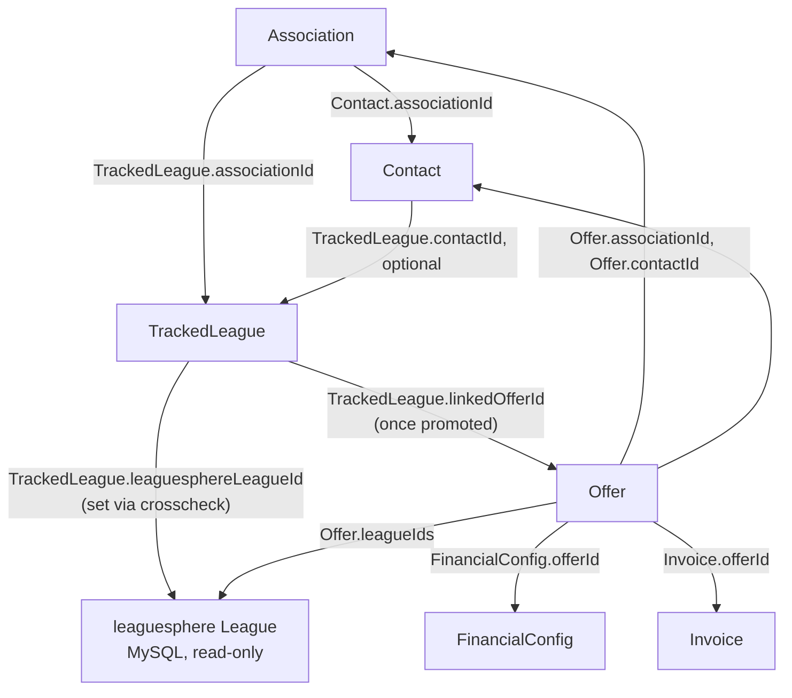

# Domain Architecture: Sales Pipeline → Contract → Invoice

This document describes how the core domain entities connect, end to end,
from an association lead to a paid invoice. It exists because that chain
crosses several models added at different times (`Association`, `Contact`,
`TrackedLeague`, `Offer`, `FinancialConfig`, `Invoice`) and the connections
between them are not obvious from any single file.

For code layout (client/server/shared folders) see [`AGENTS.md`](../AGENTS.md#architecture--boundaries).
For tRPC endpoint shapes and known gotchas see [`AGENTS.md`](../AGENTS.md#domain-data-shapes--gotchas).

## Entities and where they live

| Entity | Storage | Identity |
| --- | --- | --- |
| `Association` | MongoDB | `_id`, optionally linked to a real leaguesphere association via `leaguesphereAssociationId` (nullable — a virtual association like a federation has none) |
| `Contact` | MongoDB | `_id`, optionally linked to one association via `associationId` (nullable string) |
| leaguesphere League | MySQL (`gamedays_league`), read-only | numeric id, always fetched season-scoped (`finance.leagues.listBySeason`) — never a Mongo document |
| `TrackedLeague` | MongoDB | `_id`; a sales-pipeline lead for one association, before (or instead of) a real `Offer` existing |
| `Offer` | MongoDB | `_id`; a real, priced bundle of leaguesphere league ids sent to one contact for one season |
| `FinancialConfig` | MongoDB | pricing inputs per `(offerId, leagueId)` — see `computeConfigPrices()` |
| `Invoice` | MongoDB | `_id`; one invoice for one `Offer` |

## The connection graph

Two of these edges are **computed on read, never persisted** — the same
pattern used throughout this codebase (see `computeConfigPrices()` in
`src/server/lib/configPricing.ts`):

- **`TrackedLeague` → leaguesphere League**: `finance.trackedLeagues.crosscheck`
  name-matches an unlinked `TrackedLeague` against real leaguesphere leagues
  for its resolved season, on every page view. Nothing about a match or
  non-match is stored until a user confirms it (which sets
  `leaguesphereLeagueId`).
- **`TrackedLeague` → its pipeline stage**: once `linkedOfferId` is set,
  `computeTrackedLeagueEffectiveStatus()`
  (`src/server/lib/trackedLeagueStatus.ts`) derives the displayed stage
  (draft / awaiting decision / rejected / accepted / invoiced / paid) live
  from the linked `Offer` and, if one exists, its `Invoice`. The
  `TrackedLeague.status` field itself only matters *before* a real offer
  exists (`lead` / `contacted` / `offer_in_progress` / `rejected_pre_offer`
  / `closed_historical`).

## Following the connection in the UI

This is the concrete path a user follows from the associations list to a
real offer:

1. **`/associations`** — `AssociationList` renders each `Association`. Its
   "View leagues & contacts →" affordance (distinct from clicking the card,
   which opens the edit modal) navigates to the detail page.
2. **`/associations/:id`** (`AssociationDetailPage`) — shows the
   association's `Contact`s (`finance.contacts.list({ associationId })`)
   and its `TrackedLeague`s (`finance.trackedLeagues.list({ associationId })`),
   grouped by year, via `TrackedLeagueList`.
3. Each `TrackedLeague` row's status badge is a link **once
   `effectiveStatus.offerId` is present** (i.e. `linkedOfferId` is set) —
   clicking it navigates to `/offers/:offerId`. Before that, there is
   nothing to link to: the lead has no offer yet.
4. Selecting one or more linked `TrackedLeague`s (same contact, same year,
   all with a resolved `leaguesphereLeagueId`) and clicking "Create Offer
   from Selected" calls `finance.offers.create`, then
   `finance.trackedLeagues.linkToOffer` to set `linkedOfferId` on the
   selected leads, and navigates to `/offers/:id/edit`. This is the one
   place a `TrackedLeague` gets connected to an `Offer`.

If a `TrackedLeague` was imported by the one-time sheet migration
(`src/server/db/migrations/004-import-tracked-leagues.js`) or created
manually and never linked, there is intentionally no offer to navigate to
— that is the correct "still just a lead" state, not a bug.

## Spec and plan

The design rationale (why `TrackedLeague` is separate from `Offer` rather
than loosening `Offer.leagueIds`, why status derives from the linked
`Offer`/`Invoice` instead of being duplicated, etc.) is recorded in:

- [`docs/superpowers/specs/2026-09-10-tracked-leagues-design.md`](superpowers/specs/2026-09-10-tracked-leagues-design.md)
- [`docs/superpowers/plans/2026-09-10-tracked-leagues.md`](superpowers/plans/2026-09-10-tracked-leagues.md)
